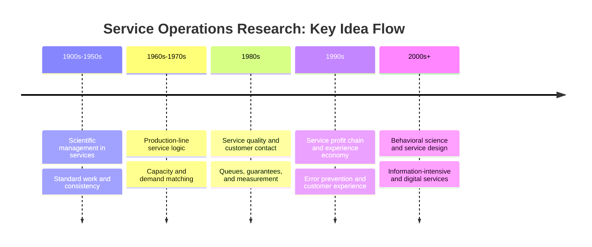
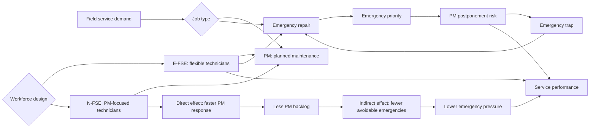

# Industrial Service Operations Analysis

Field-service operations may look simple from the outside: a machine fails, a technician is dispatched, and the issue is fixed. In practice, the management problem is more subtle. Which jobs can be planned? Which jobs are urgent? How much workforce flexibility is worth the training cost? When does delayed preventive maintenance turn into emergency workload?

This repository is a public portfolio edition of a critical reading and analysis project developed from internship-period study work. It focuses on industrial service operations, field-service workforce design, preventive maintenance, emergency work, and cross-training trade-offs.

The goal is not to publish raw source material. The goal is to present a clean, anonymized, and reproducible technical project built from academic reading, structured analysis, and a small illustrative simulation.

## Purpose

The project examines how workforce flexibility can affect backlog, utilization, and service responsiveness in a field-service setting.

The Python model in this repository is intentionally simple. It is not a copy of any real organizational model and does not use private data. It is a teaching-oriented simulation that makes the trade-off between flexible technicians, preventive maintenance capacity, and emergency workload easier to reason about.

## Context

The project grew out of a critical reading assignment involving two academic papers:

1. A paper on the history of service operations research, used here as the conceptual background.

2. A paper on cross-training policies in field services, used here as the main technical reference point.

The repository does not include the original PDFs, copied tables, copied figures, or long excerpts from those papers. The sources are cited bibliographically in `REFERENCES.md`, while the project content is written as original analysis and technical notes.

## What This Project Does

This project turns academic reading into a portfolio-ready analysis workflow:

- reframes service operations as a capacity and process-design problem
- explains the difference between preventive maintenance and emergency work
- describes the trade-off between flexible technicians and PM-focused technicians
- introduces direct effect, indirect effect, backlog, utilization, and emergency-trap mechanisms
- provides a small illustrative Python simulation for experimenting with simplified service-capacity assumptions
- keeps the public version separate from raw source documents and copyrighted academic material

## Key Takeaways

- Field-service performance depends on the balance between planned work and emergency work.
- Fully flexible technicians can be valuable because they are easier to assign across job types.
- A limited share of PM-focused capacity can help when preventive work is large enough and delayed PM creates avoidable emergencies.
- Cross-training decisions should be evaluated together with workload, maintenance frequency, machine reliability, travel time, and service-level goals.
- A public portfolio version should focus on the anonymized problem, original analysis, and reproducible modeling rather than raw source documents.

## Diagrams

Key idea flow in service operations research:



Core mechanism in the field-service cross-training decision:



## Quick Start

```powershell
python .\src\field_service_toy_simulation.py
```

## Repository Structure

- `README.md`: Turkish project overview
- `README.en.md`: English project overview
- `REFERENCES.md`: Bibliographic references
- `docs/tr/`: Turkish technical notes
- `docs/en/`: English portfolio overview
- `docs/figures/`: Mermaid diagrams
- `notebooks/field_service_toy_simulation.ipynb`: Notebook for the illustrative simulation
- `src/field_service_toy_simulation.py`: Reproducible Python demo simulation

## Public-Safe Note

This repository is designed as a public-safe portfolio artifact. It does not include:

- raw source documents
- personal names or signature/stamp fields
- private organizational information
- copyrighted academic PDFs
- copied paper tables, figures, or long direct quotations

The project should be read as an independent analysis derived from critical reading, not as a publication of private source materials.

## How Sources Are Cited

Sources are listed in `REFERENCES.md` with bibliographic information. The analysis does not reproduce the original papers. It cites them as intellectual starting points and rewrites the discussion in a public, original, and portfolio-oriented form.

This keeps two boundaries clear: the academic sources are acknowledged, and the repository does not redistribute copyrighted or private materials.
