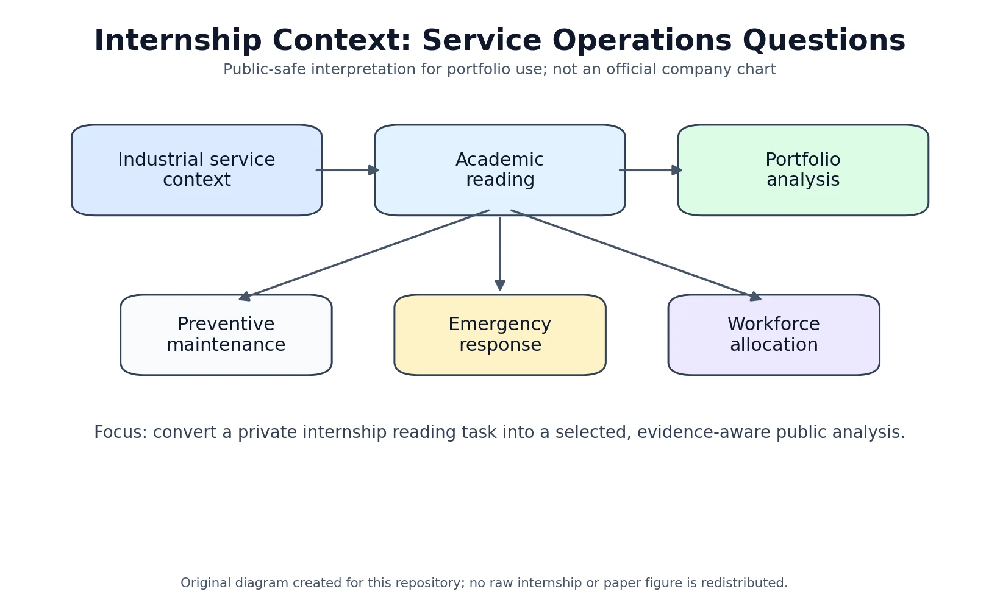
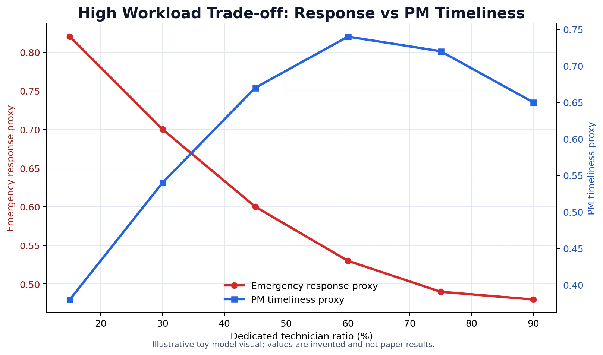

# Industrial Service Operations Analysis

Bu repo, Siemens Energy stajı sırasında yapılan iki akademik makale analizinin kamusal, seçilmiş sürümüdür. Amaç ham staj defteri yayımlamak değil; hizmet operasyonları, saha servis işgücü tasarımı ve önleyici bakım kararları üzerine teknik olarak dürüst, okunabilir ve portföy değeri olan bir çalışma sunmaktır.

Bu çalışma Siemens Energy tarafından hazırlanmış, onaylanmış veya kurumsal görüş olarak yayımlanmış bir doküman değildir. İçerik; akademik okuma, kişisel analiz, kamuya uygun yeniden yazım ve küçük bir demo simülasyondan oluşur.

## Proje özeti

Proje iki akademik makaleden hareket eder:

- Chase ve Apte'nin hizmet operasyonları araştırmasının tarihsel gelişimini ele alan çalışması
- Colen ve Lambrecht'in saha servisinde çapraz eğitim politikalarını inceleyen çalışması

İlk makale, hizmet operasyonlarının neden ayrı bir operasyon yönetimi alanı olarak ele alınması gerektiğine dair kavramsal arka plan sağlar. İkinci makale ise saha servis ekiplerinde esneklik, uzmanlaşma, önleyici bakım ve acil müdahale kapasitesi arasındaki teknik dengeyi tartışmak için ana ekseni oluşturur.



## Neden önemli

Saha servis operasyonları yalnızca arıza olduğunda teknisyen göndermekten ibaret değildir. Planlı bakım işleri, acil arıza talepleri, teknisyen yetkinliği, seyahat süresi, müşteri beklentisi ve kapasite kullanımı aynı anda yönetilir.

Bu repo özellikle şu soruya odaklanır:

> Bir saha servis organizasyonu, tüm teknisyenleri esnek hale getirmeli mi, yoksa önleyici bakım için daha odaklı kapasite ayırmalı mı?

Bu sorunun tek bir doğru cevabı yoktur. İş yükü, bakım periyodu, makine güvenilirliği, sözleşme kapsamı ve hizmet seviyesi hedefleri kararın sonucunu değiştirebilir.

## İçerik haritası

- [internship_summary.md](internship_summary.md): Staj bağlamı, görev tanımı ve repoya dönüştürme motivasyonu
- [article1_analysis.md](article1_analysis.md): Hizmet operasyonları tarihçesi için kısa kavramsal analiz
- [article2_analysis.md](article2_analysis.md): Saha servis çapraz eğitim kararı için teknik analiz
- [publication_notes.md](publication_notes.md): Kamuya açık paylaşım, telif ve gizlilik sınırları
- [references/bibliography.md](references/bibliography.md): Kullanılan iki akademik çalışmanın bibliyografik künyeleri
- [references/citations.bib](references/citations.bib): BibTeX kayıtları
- [src/field_service_toy_simulation.py](src/field_service_toy_simulation.py): Makaleyi kopyalamayan, öğretici demo simülasyon
- [notebooks/field_service_toy_simulation.ipynb](notebooks/field_service_toy_simulation.ipynb): Simülasyon not defteri

## Teknik temalar

- Hizmet operasyonları araştırmasının kavramsal gelişimi
- Saha servisinde önleyici bakım ve acil müdahale ayrımı
- E-FSE / N-FSE işgücü tasarımı
- Cross-training ve uzmanlaşma trade-off'u
- Direct effect, indirect effect ve emergency trap mekanizması
- Backlog, utilization, response time ve penalty-like score gibi metriklerin birlikte yorumlanması
- Model varsayımlarını sorgulama ve sonuçları bağlama göre okuma



## Kamuya açık sürüm notu

Bu repo ham staj defteri, kurum içi belge, telifli PDF arşivi veya makale kopyası değildir.

Public sürümde özellikle dışarıda bırakılanlar:

- Ham DOCX/PDF dosyaları
- Form sayfaları, imza/kaşe alanları ve kişisel bilgiler
- Kurum içi detay izlenimi verebilecek metinler
- Telifli makale tabloları, figürleri ve uzun doğrudan alıntılar
- Kaynağı belirsiz üçüncü taraf görseller

Teknik fikirler özgün dille yeniden yazılmıştır. Görsel fikirler gerekiyorsa kopyalanmış görsel olarak değil, yeniden çizilmiş diyagram veya sadeleştirilmiş açıklayıcı figür olarak kullanılmalıdır.

## Okuma sırası

1. Önce [internship_summary.md](internship_summary.md) ile staj bağlamını ve bu repoya dönüşme motivasyonunu okuyun.
2. Ardından [article1_analysis.md](article1_analysis.md) ile hizmet operasyonları arka planını görün.
3. Sonra [article2_analysis.md](article2_analysis.md) ile projenin ana teknik kısmına geçin.
4. Kamuya açık paylaşım sınırları için [publication_notes.md](publication_notes.md) dosyasını kontrol edin.
5. Demo modelin mantığını görmek için `src/field_service_toy_simulation.py` dosyasını çalıştırın:

```powershell
python .\src\field_service_toy_simulation.py
```
