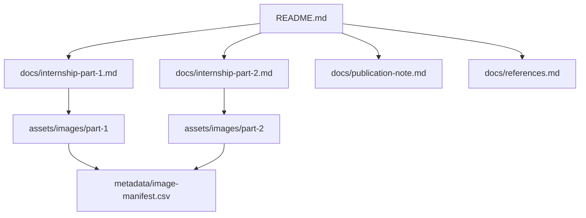

# Industrial Service Operations Analysis

Bu repo, Siemens Energy stajı sırasında hazırladığım iki akademik makale analizinin GitHub'a uygun, seçilmiş ve kamusal sürümüdür.

Amaç ham staj defterini arşivlemek değil; hizmet operasyonları, saha servisi, bakım planlama ve analitik düşünme tarafındaki çalışmayı okunabilir bir portföy çıktısına dönüştürmektir.

## Neden Önemli?

Çalışma iki beceriyi birlikte gösterir: akademik bir metni teknik olarak anlamlandırmak ve bu metindeki karar problemini saha servisi bağlamına dikkatli biçimde bağlamak.

Özellikle ikinci yazı, bakım iş yükü, önleyici bakım, acil müdahale, teknisyen yetkinliği ve müşteri performansı arasındaki dengeyi tartıştığı için repodaki ana teknik ağırlığı taşır.

## Ana İçerik

- [Makale Ödevi 1: Hizmet Operasyonları Hakkında Bir Deneme](docs/internship-part-1.md)  
  Hizmet operasyonları literatüründeki tarihsel ve kavramsal çizgiyi; standardizasyon, deneyim tasarımı, süreç düşüncesi ve kişisel operasyon gözlemleriyle birlikte ele alır.

- [Makale Ödevi 2: Saha Servisinde Çapraz Eğitim Politikaları](docs/internship-part-2.md)  
  PM/emergency ayrımı, E-FSE/N-FSE işgücü yapısı, kapasite kısıtları, kullanılabilirlik, ceza puanı, emergency trap ve sözleşme kapsamı üzerinden daha teknik bir analiz sunar.

## Repo Yapısı

## Nasıl Okunmalı?

Teknik değerlendirme için önce ikinci yazıdan başlamak daha verimli olur. Birinci yazı, hizmet operasyonları tarafındaki kavramsal arka planı ve staj defterindeki daha deneme karakterli düşünme çizgisini tamamlar.

Önerilen sıra:

1. [Makale Ödevi 2: Saha Servisinde Çapraz Eğitim Politikaları](docs/internship-part-2.md)
2. [Makale Ödevi 1: Hizmet Operasyonları Hakkında Bir Deneme](docs/internship-part-1.md)
3. [Yayın notları ve kapsam sınırları](docs/publication-note.md)
4. [Kaynaklar](docs/references.md)

## Yayın Notu

Bu repo resmi kurum görüşü, kaynak makale reprodüksiyonu veya ham staj defteri paylaşımı değildir.

Kamuya açık sürüm hazırlanırken kişisel/kurumsal ayrıntılar ayıklanmış, telifli PDF dosyaları repoya eklenmemiş, görseller kamuya açık portföy kullanımına uygun olacak biçimde seçilmiş veya yeniden düzenlenmiştir. Kaynaklar bibliyografik düzeyde gösterilir; orijinal dosyalar yeniden dağıtılmaz.
