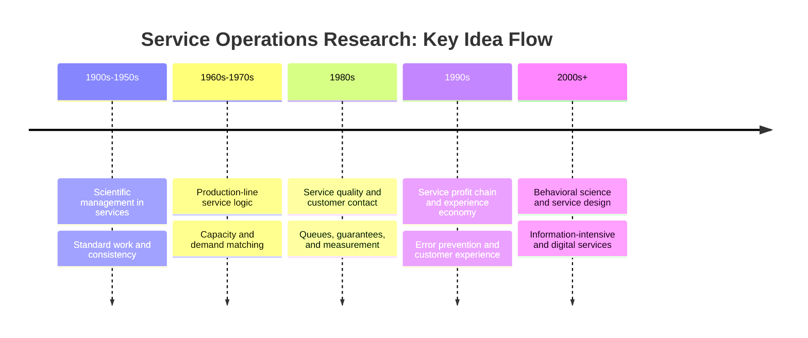
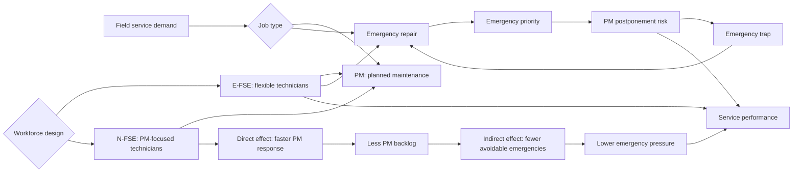

# Industrial Service Operations Analysis

Saha servis operasyonları dışarıdan yalnızca "arıza olduğunda teknik ekip göndermek" gibi görünebilir. Oysa arka planda daha zor bir karar problemi vardır: hangi işler planlanabilir, hangileri acildir, ekip ne kadar uzmanlaşmalı, ne kadar esnek kalmalıdır?

Bu depo, staj döneminde yapılan akademik okuma çalışmasını kamuya açık ve portföy odaklı bir analiz projesine dönüştürür. Amaç ham çalışma belgesi paylaşmak değil; hizmet operasyonları ve saha servis işgücü tasarımı üzerine okunabilir, anonim ve yeniden üretilebilir bir çalışma ortaya koymaktır.

## Projenin Amacı

Bu projenin amacı, endüstriyel saha servis operasyonlarında önleyici bakım, acil müdahale, teknisyen yetkinliği ve kapasite kullanımı arasındaki ilişkiyi sade bir çerçevede incelemektir.

Depodaki Python simülasyonu gerçek bir organizasyon modelinin kopyası değildir. Öğretici amaçlı bir demo modeldir; temel hedefi, çapraz eğitim ve uzmanlaşma kararlarının backlog ve utilization gibi metriklerle nasıl tartışılabileceğini göstermektir.

## Bağlam

Çalışma, iki akademik makaleyi okuma, anlama, yorumlama ve operasyon yönetimi açısından uygulanabilir çıkarımlara dönüştürme sürecinden doğdu.

Bu süreçte odak özellikle şu sorulara kaydı:

- Hizmet operasyonları neden ayrı bir operasyon yönetimi problemi olarak ele alınır?
- Saha servis ekiplerinde esneklik ile uzmanlaşma arasında nasıl bir denge vardır?
- Önleyici bakım geciktiğinde acil iş yükü nasıl büyüyebilir?
- Basit bir simülasyon, bu karar mantığını görünür kılmak için nasıl kullanılabilir?

## İncelenen İki Çalışma

1. Chase ve Apte'nin hizmet operasyonları araştırmasının tarihsel gelişimini ele alan çalışması, projenin kavramsal arka planını oluşturur.

2. Colen ve Lambrecht'in saha servisinde çapraz eğitim politikalarını inceleyen çalışması, projenin ana teknik eksenini oluşturur.

Bu depoda bu iki çalışmanın PDF dosyaları, tabloları, grafikleri veya uzun metin alıntıları paylaşılmaz. Kaynaklar yalnızca bibliyografik düzeyde belirtilir ve içerik özgün portföy anlatısına dönüştürülür.

## Benim Bu Çalışmada Yaptığım Şey

Bu çalışmada iki makaleyi yalnızca özetlemek yerine, operasyon yönetimi açısından ne söylediklerini ve kamuya açık bir portföy projesine nasıl dönüştürülebileceklerini inceledim.

Yapılan işin ana parçaları:

- Hizmet operasyonları literatüründeki kavramları sade bir proje diline çevirmek
- Saha servisinde önleyici bakım ve acil bakım ayrımını analiz etmek
- Esnek teknisyen ve PM odaklı teknisyen ayrımını kamuya açık bir model diline dönüştürmek
- Doğrudan/dolaylı etki, backlog ve kapasite kullanımı gibi kavramları uygulanabilir şekilde ele almak
- Telifli ve kuruma özgü içeriklerden ayrıştırılmış bir GitHub depo yapısı tasarlamak
- Basitleştirilmiş bir Python simülasyonu ile karar mantığını deneysel olarak göstermek

## Temel Çıkarımlar

- Saha servis operasyonlarında en kritik meselelerden biri, planlı işler ile acil işler arasında kapasite dengesini korumaktır.
- Tamamen esnek işgücü, atama kolaylığı sağlayabilir; ancak bazı planlı işlerin özel ekiplerce yürütülmesi belirli koşullarda fayda yaratabilir.
- Önleyici bakımın gecikmesi, acil iş yükünü artırarak servis ekibini daha zor bir döngüye sokabilir.
- Çapraz eğitim kararı yalnızca eğitim maliyetiyle değil; iş yükü, bakım sıklığı, makine güvenilirliği, seyahat süresi ve hizmet seviyesi hedefleriyle birlikte düşünülmelidir.
- Kamuya açık portföyde en güvenli anlatı, belirli bir kurum veya ham çalışma belgesi yerine anonim problem, özgün analiz ve tekrar çalıştırılabilir küçük model üzerine kurulmalıdır.

## Demo Model

Bu repodaki simülasyon eğitim amaçlıdır ve açıkça illustrative / not a reproduction of the paper olarak tasarlanmıştır. Makaledeki verileri kullanmaz, makale sonuçlarını yeniden üretme iddiası taşımaz.

Modelde dört parametreyle oynanabilir:

- `workload`
- `preventive_maintenance_interval`
- `machine_reliability_proxy`
- `dedicated_technician_ratio`

Script, farklı PM odaklı teknisyen oranlarını karşılaştıran küçük bir tablo üretir:

```powershell
python .\src\field_service_toy_simulation.py
```

Notebook ise üç görsel üretir:

- emergency response proxy
- PM timeliness proxy
- total penalty-like score

## Diyagramlar

Hizmet operasyonları literatüründeki ana fikir akışı:



Saha servis çapraz eğitim kararındaki temel mekanizma:



## Repo İçeriği

- `README.md`: Türkçe proje tanıtımı
- `README.en.md`: İngilizce proje tanıtımı
- `REFERENCES.md`: Akademik kaynakların bibliyografik künyeleri
- `docs/tr/project-overview.md`: Türkçe proje kapsamı
- `docs/tr/article-1-service-operations-history.md`: Hizmet operasyonları tarihçesi için teknik okuma notu
- `docs/tr/article-2-field-service-cross-training.md`: Saha servis çapraz eğitim analizi
- `docs/tr/what-i-did.md`: Yapılan işin kamuya açık özeti
- `docs/tr/lessons-learned.md`: Proje boyunca çıkarılan dersler
- `docs/tr/public-sharing-note.md`: Gizlilik ve telif açısından paylaşım notu
- `docs/en/project-overview.md`: İngilizce portföy özeti
- `docs/figures/`: Mermaid diyagramları
- `notebooks/field_service_toy_simulation.ipynb`: Simülasyon not defteri
- `src/field_service_toy_simulation.py`: Tekrarlanabilir demo simülasyon

## Kamuya Açık Paylaşım Notu

Bu repo, kamuya açık paylaşım için güvenli olacak şekilde tasarlanmıştır.

Depoya dahil edilmeyen içerikler:

- Ham çalışma belgeleri
- Kişi adları, imza/kaşe alanları ve tanımlayıcı bilgiler
- Kurum içi bilgi izlenimi verebilecek ayrıntılar
- Telifli akademik PDF dosyaları
- Makale tabloları, grafik kopyaları veya uzun doğrudan alıntılar

Bu nedenle proje, ham belge yayını değil; staj döneminde yapılan akademik okuma ve analiz çalışmasından türetilmiş bağımsız bir portföy projesi olarak okunmalıdır.

## Kaynaklara Nasıl Atıf Yapıldığı

Kaynaklar `REFERENCES.md` dosyasında bibliyografik künyeleriyle listelenir. Metin içinde kaynaklardan uzun alıntı yapılmaz; makalelerdeki fikirler özgün ifadelerle, analiz ve çıkarım düzeyinde ele alınır.

Bu yaklaşımın amacı iki şeyi birlikte korumaktır:

- Akademik kaynaklara doğru atıf vermek
- Telifli yayınları veya ham kaynak materyallerini repoda yeniden yayımlamamak
