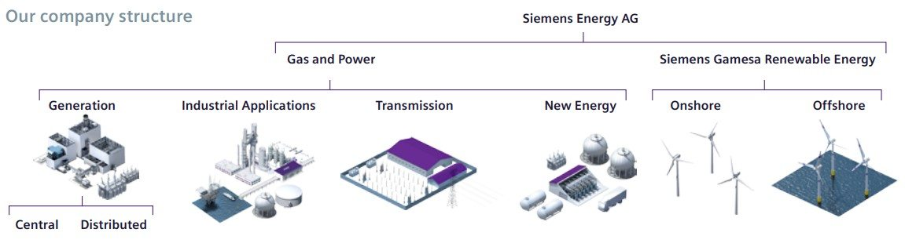
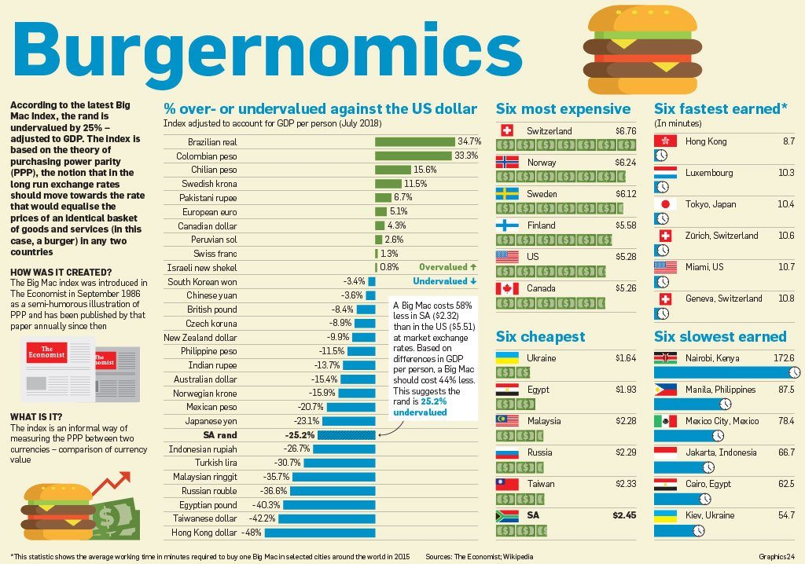

# Hizmet Operasyonları Hakkında Bir Deneme

Bu yazı, Siemens Energy stajım sırasında bana verilen iki akademik makale analizinden ilkinin kamuya açık ve düzenlenmiş sürümüdür. Ham staj defterinin birebir aktarımı değildir; ama o defterdeki düşünme biçimini, yer yer aceleci ve kişisel enerjisini tamamen kaybetmeden daha okunabilir bir Markdown yazısına dönüştürür.

Bu bölümün odağı, Richard B. Chase ve Uday M. Apte tarafından yazılan *A history of research in service operations: What’s the big idea?* makalesidir. Makale, hizmet operasyonları araştırmasının tarihsel gelişimini ve bu alanın neden klasik üretim/imalat operasyonlarından ayrı düşünülmesi gerektiğini tartışır.

Benim için bu ödevin değeri sadece bir makaleyi anlamak değildi. Daha çok, “operasyon yönetimi” denen şeyin fabrika çizelgelemesinden ibaret olmadığını; hizmet, insan davranışı, müşteri algısı, süreç tasarımı ve deneyim ekonomisiyle birlikte düşünülmesi gerektiğini fark ettiğim bir eşik olmasıydı.

> Editoryal not: Bu dosya, staj defterindeki kişisel/kurumsal form alanlarını, imza/kaşe bölümlerini ve ham polemik yan sapmaları dışarıda bırakır. Görsel kullanımı için [görsel manifesti](../metadata/image-manifest.csv) ve [yayın notu](publication-note.md) birlikte okunmalıdır.[^gorsel-notu]

## Staj ve Endüstriyel Hizmet Bağlamı

Staj defterimde Siemens Enerji bağlamını önce şirketin faaliyet alanlarını anlamaya çalışarak kurmuştum. Defterde Siemens Energy’nin yeni bir şirketleşme yapısı içinde olsa da köklerini Siemens’in uzun endüstriyel geçmişinden aldığı, enerji üretimi, endüstriyel uygulamalar, iletim çözümleri, yeni enerji alanları ve rüzgar enerjisi gibi geniş bir alanda konumlandığı anlatılıyordu.

Bu bağlam benim için önemliydi çünkü okuduğum makaleler soyut bir “hizmet sektörü” tartışması gibi kalmadı. Enerji ekipmanları, türbinler, jeneratörler, kompresörler, bakım ve modernizasyon hizmetleri gibi ağır endüstriyel sistemlerin yanında düşünülünce hizmet operasyonları daha somut hale geldi. Burada hizmet, yalnızca müşteriyle kibar konuşmak ya da çağrı merkezi yönetmek değildir; yüksek maliyetli teknik varlıkların çalışır durumda kalmasını sağlayan operasyonel bir sistemdir.

*Şirket bağlamını kısa yoldan göstermesi için bırakılan destek görseli; teknik iddia kaynağı olarak kullanılmıyor.*

## İki Makale Görevinin Tanımı

Staj sırasında bana iki akademik makale verildi. Beklenen şey, bu makaleleri yalnızca özetlemek veya Türkçeye çevirmek değildi. Makaleleri okuyup ne anladığımı, nerelerde zorlandığımı, hangi kavramları başka örneklerle ilişkilendirdiğimi ve hangi noktalarda eleştirel düşündüğümü yazıya dökmem gerekiyordu.

İki makale şunlardı:

- *A history of research in service operations: What’s the big idea?*
- *Cross-training policies in field services*

İlk makale daha kavramsal ve tarihsel bir metindi. Hizmet operasyonları araştırmasının hangi büyük fikirler etrafında geliştiğini anlatıyordu. Adam Smith’ten bilimsel yönetime, hizmet kalite anlayışından davranışsal ekonomi etkilerine kadar geniş bir çerçeve çiziyordu.

İkinci makale ise daha teknikti. Saha servisinde çapraz eğitim, önleyici bakım, acil bakım, teknisyen tipi ve müşteri performans metrikleri arasındaki ilişkiyi model üzerinden tartışıyordu. İlk makaleden edindiğim kavramsal altyapı, ikinci makaleyi anlamamı kolaylaştırdı. Bu yüzden bu dosya kavramsal zemin, `internship-part-2.md` ise teknik merkez olarak düşünülmelidir.

Bu iki ödev için staj defterimde özellikle şunu vurgulamıştım: Bunlar orijinal makalelerin özeti veya çevirisi değildi. Makalelerden anladıklarımı, yorumlarımı, eleştirilerimi ve okurken aklıma gelen bağlantıları yazmaya çalıştım. Bazen konu dışına çıktığım da oldu; bu public sürümde o taşmaların bir kısmını kestim, bir kısmını ise daha kontrollü bir dille korudum.

## Kavramsal Deneme

Bu yazı, *A history of research in service operations: What’s the big idea?* makalesi temelinde hizmet operasyonları üzerine kişisel bir denemedir. Makaleyi ilk okuduğumda, hizmet operasyonlarının yalnızca “hizmet sektörü büyüyor” gibi basit bir ekonomik gözlemden ibaret olmadığını fark ettim.

Hizmet operasyonları; insanın sürecin içinde olduğu, müşterinin çoğu zaman üretim anına temas ettiği, kalite algısının yalnızca teknik çıktıyla değil deneyimle de oluştuğu bir alan. Bu yüzden imalat mantığıyla hizmet mantığı arasında sürekli bir akrabalık ve gerilim var.

Bu gerilimi anlamak için ham defterdeki akışı büyük ölçüde koruyorum.

### 1. Meslek Seçimi ve Ekonomik Faaliyetler

Staj defterindeki ilk düşünce şuydu: İnsanlık tarihinin büyük kısmında insanlar bugünkü anlamıyla “hizmet operasyonları” içinde yaşamıyordu. Tarım, avcılık, zanaat, daha sonra sanayi üretimi ve en sonunda hizmet ekonomisinin ağırlık kazanması uzun bir tarihsel dönüşümün sonucu.

Bu bölümde yaptığım kaba kuşak hesabı kusursuz bir tarihsel model değildi. Zaten ham defterde de verilerin yuvarlandığını ve her ülke için aynı gelişim çizgisinin geçerli olmadığını belirtmiştim. Ama asıl anlatmak istediğim şuydu: Bugün bize doğal gelen hizmet ağırlıklı ekonomi, insanlık tarihi ölçeğinde oldukça yeni bir durum.

Bu farkındalık önemli çünkü hizmet operasyonlarını anlamak için önce bunun tarihsel olarak neden ayrı bir mesele haline geldiğini görmek gerekiyor. Bir toplumda insanların çoğu tarım veya üretim dışı alanlarda çalışmaya başladığında, operasyon yönetimi de yalnızca “daha hızlı üretmek” sorusuyla yetinemez.

### 2. Sonraki Nesiller ve Hizmete Kayış

Atalarımız için kurduğum meslek-kuşak tablosunun bir benzerini gelecek nesiller için kurmaya çalışırsak tabloyu muhtemelen yeniden tasarlamak gerekir. Çünkü bugün hizmet sektörü dediğimiz şey de kendi içinde dönüşüyor.

Bir yanda dijital hizmetler, uzaktan bakım, yazılım destekli operasyonlar ve veri odaklı karar sistemleri var. Diğer yanda yaşlanan altyapılar, enerji sistemleri, saha servisleri ve fiziksel ekipmanların hâlâ çok gerçek bakım ihtiyaçları var.

Bu nedenle hizmet operasyonları yalnızca “insan insana hizmet” alanı değildir. Giderek daha fazla teknoloji, veri, uzaktan izleme ve saha koordinasyonu içerir. Bu nokta, ikinci makaledeki saha servis problemiyle de doğrudan bağlanır.

### 3. Sanayiden Hizmete Doğru

Sanayi Devrimi, işgücünü tarımdan üretime kaydırdı. Daha sonra gelişmiş ekonomilerde hizmet sektörünün payı arttı. Ham defterde bu dönüşümü anlatırken bazı politik ve ekonomik örneklerle sert yorumlar yapmıştım; public sürümde o kısmı daha dar bir operasyon yönetimi çerçevesine çekiyorum.

Benim için önemli olan şuydu: Hizmet sektörü büyüdükçe verimlilik, kalite ve süreç tasarımı soruları ortadan kalkmıyor; aksine daha karmaşık hale geliyor. Üretimde çıktıyı ölçmek görece daha kolay olabilir. Hizmette ise sonuç, süreç ve algı birbirine daha sıkı bağlıdır.

Bir müşteri teknik olarak doğru hizmet almış olabilir; ama süreç boyunca kendini dinlenmemiş, bekletilmiş veya belirsizlik içinde bırakılmış hissediyorsa hizmet kalitesi düşük algılanabilir. Hizmet operasyonlarını ilginç yapan şeylerden biri tam da bu ölçüm zorluğudur.

### 4. İlk Çalışmalar ve İnsan Faktörü

Adam Smith’in ekonomik etkinlik sınıflandırmalarından bilimsel yönetime uzanan çizgide, hizmetin uzun süre üretim kadar merkezi görülmediği söylenebilir. Fakat modern ekonomilerde istihdamın büyük kısmı hizmet alanına kaydıkça hizmet operasyonları ayrı bir araştırma konusu haline geldi.

Ham defterde bu kısmı “insan-fonksiyon” benzetmesiyle anlatmıştım. Bir makineyi iyi tasarlarsanız aynı girdiye aynı çıktıyı verme ihtimali yüksektir. İnsan ise aynı girdiye farklı zamanlarda farklı çıktılar verebilir. Hatta iki insan, aynı prosedürü uygulasa bile müşteriyle kurdukları temas, dikkat düzeyleri, motivasyonları ve deneyimleri nedeniyle farklı sonuçlar üretebilir.

Bu, hizmet operasyonlarında standardizasyonun gereksiz olduğu anlamına gelmez. Tam tersine, standardizasyon daha da dikkatli tasarlanmalıdır. Çünkü sistemin içinde değişkenliği yüksek bir unsur vardır: insan.

Buradan çıkardığım ders şuydu: Hizmet operasyonlarında iyi süreç tasarımı, insanı makine gibi varsaymak değildir. İnsanın değişkenliğini kabul edip buna rağmen güvenilir, öğrenebilen ve kendini düzeltebilen bir sistem kurmaktır.

### 5. McDonald's: Standardizasyon ve Ölçeklenebilir Hizmet

McDonald's örneği, hizmet operasyonlarında üretim hattı mantığının ne kadar etkili olabileceğini gösteren klasik örneklerden biridir. Standart iş, süreç tasarımı, ürün tutarlılığı ve ölçeklenebilirlik aynı anda çalışır.

Ham defterde dikkatimi çeken nokta, hamburgerin yalnızca bir yiyecek değil, aynı zamanda ülkeler arası satın alma gücü kıyaslamasında kullanılabilecek kadar standartlaşmış bir ürün haline gelmesiydi. Bu, operasyonel standardizasyonun ne kadar ileri taşınabileceğini gösteriyor.

*Standardizasyon fikrini görünür kılan örnek görsel. Kullanım notu için görsel manifestine bakılmalıdır.*

McDonald's örneği bana şunu düşündürdü: Hizmet deneyiminin bir kısmı müşterinin gözünün önünde yaşanır, fakat bu deneyimin arkasında sıkı bir süreç tasarımı vardır. Müşteri yalnızca hızlı servis görür; ama arka planda tedarik zinciri, iş istasyonu tasarımı, menü standardizasyonu, eğitim ve kalite kontrol çalışır.

### 6. Disney: Deneyim Tasarımı ve Sahne Arkası Operasyon

Disney örneği, hizmet operasyonlarının yalnızca verimlilik değil deneyim tasarımı meselesi olduğunu gösterir. Tema parkları, oteller, restoranlar, bekleme süreleri, ziyaretçi akışları ve fiyatlandırma kararları birlikte düşünülür.

Ham defterde bu bölümü biraz heyecanlı yazmıştım. Çünkü Disney gibi bir örnekte operasyon yönetiminin “sahne arkası” çok belirgindir. Ziyaretçi büyülü bir deneyim yaşar; fakat o deneyimin arkasında talep tahmini, kapasite planlama, kuyruk yönetimi, çalışan çizelgeleme ve müşteri davranışı analizi vardır.

*Disney örnekleri, hizmetin yalnızca verimlilik değil deneyim tasarımı boyutunu da göstermek için tutuldu.*

Bu örnekten çıkardığım operasyonel ders şu: Hizmet deneyimi rastgele oluşmaz. İyi hizmet çoğu zaman, müşterinin fark etmediği kadar iyi tasarlanmış bir sistemin sonucudur. Bekleme çizgisinin nerede başlayacağı, müşterinin ne kadar süre beklediğini nasıl algılayacağı, yiyecek fiyatlarının deneyim içindeki rolü ve çalışanların hangi anda müşteriye temas edeceği operasyonel karardır.

### 7. Kişisel Operasyon Yönetimi Deneyimi

Ham defterde bu başlık altında daha önce çalıştığım bir üretim ortamından örnek vermiştim. Orada beni etkileyen şey, çok karmaşık olmayan matematik ve dikkatli gözlemle bile ciddi verimlilik iyileştirmeleri yapılabileceğini görmekti.

Kısaca anlatmak gerekirse: Bir üretim sürecinde mevcut iş yapış biçimini gözlemledim, fire ve hız gibi çıktıları ölçmeye çalıştım, sonra daha düzenli bir üretim planı önerdim. Plan uygulandığında malzeme firesi belirgin biçimde azaldı ve üretim hızı arttı. Bu deneyim, operasyon yönetiminin sadece teorik bir ders olmadığını görmemi sağladı.

Bu örneği burada tutmamın nedeni kendimi övmek değil. Tam tersine, şu soruyu sormaktı: Eğer temel ölçüm, süreç takibi ve biraz matematikle bu kadar iyileşme görülebiliyorsa, neden birçok organizasyonda bu düşük asılı meyveler toplanmadan kalıyor?

Bu soru daha sonra hizmet operasyonlarını okurken de zihnimde durdu. Çünkü hizmette de benzer bir durum var: Bazı sorunlar pahalı teknoloji eksikliğinden değil, sürecin yeterince görünür kılınmamasından kaynaklanıyor olabilir.

### 8. Süreç: Sonuçtan Daha Fazlası

Bu bölümde ham defterde Harvard Business Review’da yayımlanan “adil süreç” fikrinden yola çıkmıştım. Anlatılan örnekte bir sürücü mahkemede lehine karar almasına rağmen kendini iyi hissetmez; çünkü kendini ifade etme fırsatı bulamamıştır.

Bu örnek hizmet operasyonları için çok güçlüdür. Çünkü hizmette sonuç kadar, sonucun nasıl üretildiği de önemlidir. Bir müşterinin problemi çözülmüş olabilir; ama süreç boyunca dinlenmediğini, açıklama alamadığını veya belirsizlik içinde bırakıldığını düşünüyorsa hizmet deneyimi zedelenir.

Operasyon yönetimi açısından bu, süreç adaletinin yalnızca etik bir mesele olmadığını gösterir. Sürecin algılanma biçimi, müşteri memnuniyeti ve çalışan bağlılığı gibi performans sonuçlarını etkileyebilir.

Benim bu bölümden çıkardığım ders şuydu: İyi operasyon, sadece doğru sonucu veren operasyon değildir. İnsanların o sonuca giden yolu anlayabildiği, kendini sürecin dışında bırakılmış hissetmediği operasyon daha dayanıklıdır.

### 9. Geri Bildirim Kültürü ve Operasyonel Güvenilirlik

Ham defterde bu başlık daha geniş ve yer yer politik bir dile açılıyordu. Public sürümde bunu operasyonel öğrenme kültürü açısından ele almak daha doğru.

Bir operasyon yöneticisi çalışanlarının fikirlerini gerçekten dinlerse birkaç şey olur. Öncelikle sahadaki küçük aksaklıklar daha erken görünür hale gelir. İkincisi, çalışanlar yalnızca verilen işi yapan kişiler değil, sistemi iyileştirebilecek bilgi kaynakları olarak görülür. Üçüncüsü, hata saklama davranışı azalabilir.

Ham defterde uçak gemisi örneğini kullanmıştım: Güvertede küçük bir parçanın kaybolması bile tüm operasyonu riske atabilir. Kritik olan şey, hatayı yapan kişinin cezalandırılma korkusuyla susması değil, hatayı hızla söyleyebilmesidir. Çünkü operasyonel güvenilirlik bazen tam olarak buna bağlıdır.

Bu bölümün özü şu: İfade özgürlüğü yalnızca soyut bir hak meselesi değildir; operasyonel öğrenme ve hata önleme açısından da işlevseldir. Çalışanların konuşamadığı sistemlerde problemler çözülmeden önce saklanır.

### 10. Farklılaşma, Deneyim ve Ölçeklenebilirlik

Hizmet operasyonlarında rekabet üstünlüğü yalnızca maliyet düşürmekle açıklanamaz. Bazen müşteri, aldığı ürün veya hizmetten çok deneyime para öder. Deneyim ekonomisi kavramını okuduğumda aklıma gelen ilk örneklerden biri Nusret olmuştu.

Ham defterde bu bölümü daha serbest bir dille yazmıştım. Burada korumak istediğim fikir şu: Nusret örneğinde müşteri yalnızca et yemiyor; sahnelenmiş bir hizmet anına katılıyor. Tuz dökme hareketi, sunum biçimi, sosyal medyada paylaşılabilirlik ve müşterinin “orada bulunmuş olma” hissi deneyimin parçası haline geliyor.

*Kolaj, deneyim ekonomisi tartışmasını somutlaştırır; kişi/fotoğraf görünürlüğü nedeniyle son yayın kararında özellikle kontrol edilmelidir.*

Bu noktada şu eleştiriler doğal olarak akla gelir: Daha sade bir hizmet tasarımı daha verimli olmaz mıydı? Garsonun yapabileceği bir işi neden şef yapıyor? Tuzun yere dökülmesi israf değil mi? Altın kaplama veya gösterişli sunum gerçek kaliteyi artırıyor mu?

Bu sorular tek tek bakıldığında mantıklı görünebilir. Ancak deneyim ekonomisi açısından mesele yalnızca teknik verimlilik değildir. Müşterinin hatırlayacağı, paylaşacağı ve tekrar etmek isteyeceği bir an üretmek de hizmet tasarımının parçası olabilir.

Yine de ham defterde vurguladığım bir karşı dengeyi burada korumak istiyorum: Farklılaştırma önemlidir ama tek başına yetmez. Bir ekonominin geniş kesimlere iyi barınma, eğitim, sağlık, ulaşım ve beslenme sağlayabilmesi için düşük maliyetli, ölçeklenebilir ve güvenilir hizmet/üretim sistemlerine de ihtiyacı vardır.

Bu yüzden hizmet operasyonlarında iki hedefi aynı anda düşünmek gerekir: İnsanların değer verdiği deneyimleri tasarlamak ve temel hizmetleri erişilebilir, verimli ve sürdürülebilir biçimde sunmak.

## Kısa Kapanış

Bu ilk makale ödevi bana hizmet operasyonlarının “müşteri memnuniyeti” gibi tek bir başlığa indirgenemeyeceğini gösterdi. Hizmet; süreç, insan, ölçüm, deneyim ve yönetim kültürünün birlikte çalıştığı bir sistemdir.

Bu kavramsal zemin, ikinci makalede karşıma çıkan saha servis problemini anlamamı kolaylaştırdı. Çünkü saha servisinde de aynı gerilim vardır: müşteri hızlı yanıt ister, ekip kapasitesi sınırlıdır, önleyici bakım ertelenirse ileride daha büyük arızalar çıkabilir ve teknisyen yetkinliği doğrudan sistem performansına yansır.

Bu nedenle `internship-part-1.md` dosyası, projenin tarihsel ve kavramsal arka planıdır. Teknik merkez ise `internship-part-2.md` dosyasında yer alacaktır.

[^gorsel-notu]: Bu dosyada kullanılan görseller için kullanım modu `metadata/image-manifest.csv` içinde kayıtlıdır. Üçüncü taraf veya kişi içeren görseller yayın öncesinde repo sahibi tarafından ayrıca gözden geçirilmelidir.
