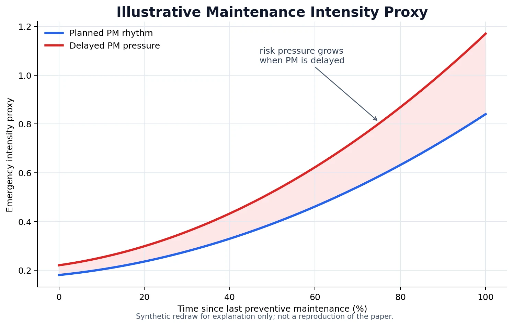
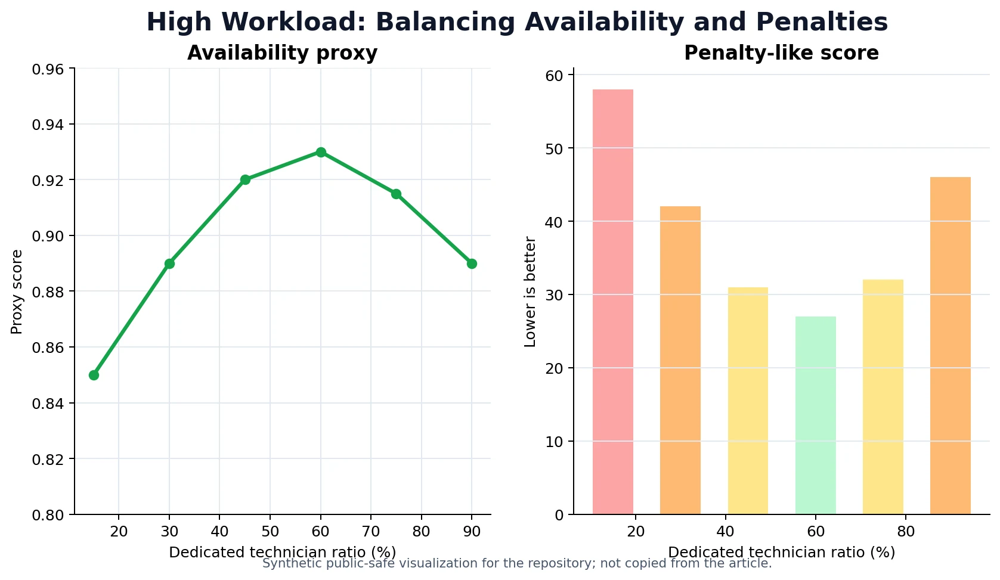

# Saha Servisinde Çapraz Eğitim Politikaları

Bu yazı, staj defterimdeki ikinci makale ödevinin kamuya açık ve teknik olarak düzenlenmiş sürümüdür. Kaynak makale, Colen ve Lambrecht'in *Cross-training policies in field services* çalışmasıdır. Bu dosya makalenin birebir özeti veya tablo/figür reprodüksiyonu değildir; modelin karar mantığını, staj defterimdeki yorumlarla birlikte yeniden kurar.

İlk makale ödevi hizmet operasyonlarının tarihsel ve kavramsal tarafını açmıştı. Bu ikinci ödev daha teknikti: Saha servisinde işgücünün ne kadarının tam çapraz eğitimli, ne kadarının önleyici bakıma odaklı olması gerektiği sorusunu tartışıyordu. Beni en çok çeken tarafı da buydu; çünkü problem bir insan kaynağı kararı gibi görünse de aslında kapasite, bakım politikası, müşteri memnuniyeti ve risk yönetimi problemiydi.

> Editoryal not: Bu dosyada kullanılan grafikler makale figürlerinin kopyası değildir. Kamuya açık repo için hazırlanmış açıklayıcı/yeniden çizilmiş görsellerdir. Ham tablo ve denklem ekran görüntüleri Markdown'a doğrudan taşınmamıştır.

## Problem Çerçevesi

Satış sonrası bakım hizmetleri birçok OEM için önemli bir gelir kalemidir. Şirket hizmet faaliyetlerini genişlettikçe bakımından sorumlu olduğu ürün sayısı ve ürün çeşitliliği artar. Her makine tipinin arızasını giderebilecek kadar geniş yetkinlikte uzman yetiştirmek pahalı olabilir. Buna karşılık çok dar uzmanlaşmış ekipler de acil arıza talebi geldiğinde yetersiz kalabilir.

Staj defterinde problemi şöyle kurmuştum: Bakım hizmeti veren bir şirket, farklı senaryolar altında işgücünün ne kadarını çapraz eğitimli olmayan uzmanlardan oluşturduğunda daha iyi performans elde eder?

Senaryo eksenleri ham notlarda şu şekilde geçiyordu:

| Değişken | Ham nottaki mantık | Karar üzerindeki etkisi |
|---|---|---|
| İş yükü | Ağır / hafif | Kapasite sıkışıklığı ve PM gecikmesi ihtimalini değiştirir |
| Makine güvenilirliği | Bakımdan sonra arıza çıkarma davranışı | PM gecikmesinin acil işe dönüşme riskini belirler |
| Bakım periyodu | 2000 saat / 3000 saat | PM sıklığını ve bakım gecikmesi riskini değiştirir |
| Sözleşme kapsamı | Sözleşmeli makine sayısı / tüm makine sayısı | Planlı iş oranını ve N-FSE ihtiyacını etkiler |

Bu yüzden problem “kaç teknisyen almalıyız?” sorusundan daha geniştir. Asıl soru şudur: Hangi iş yükü, makine güvenilirliği, bakım aralığı ve sözleşme kapsamı altında hangi işgücü konfigürasyonu daha dayanıklı çalışır?

## PM / Emergency Ayrımı

Modelde iki bakım türü ayrılıyor:

| Bakım türü | Açıklama | Operasyonel anlamı |
|---|---|---|
| PM | Önleyici bakım, acil olmayan bakım | Planlanabilir; doğru zamanda yapılırsa arıza riskini azaltabilir |
| Emergency | Onarıcı/acil bakım | Arıza sonrası gelir; öncelik alır ve kapasiteyi sıkıştırır |

PM işlerinin belirli bir zaman penceresinde yapılması gerekir. Ham notta bu pencere bakım periyodunun yaklaşık yüzde 10 komşuluğu olarak anlatılmıştı. Örneğin bakım periyodu 200 gün ise bakımın 180-220 gün aralığında yapılması beklenir. Bu pencerenin dışına çıkıldığında bakım artık normal PM gibi davranmaz; gecikmenin acil işe dönüşme riski doğar.

Bu ayrım makalenin kalbidir. Çünkü acil işler öncelik aldığında PM ertelenebilir; PM ertelenince bazı işler acile dönüşebilir; acile dönüşen işler de PM'i daha fazla geriye iter. Ben bunu staj defterinde “emergency trap” olarak okumuştum.

## E-FSE / N-FSE Ayrımı

Model iki teknisyen tipini ayırıyor:

| Teknisyen tipi | Yapabildiği işler | Saha servisindeki rolü |
|---|---|---|
| E-FSE | PM + emergency | Esnek kapasite; acil taleplere yanıt verebilir |
| N-FSE | PM | Önleyici bakım kapasitesini rahatlatır; acil arızaya gidemez |

E-FSE sistemin tampon kapasitesidir. Acil iş geldiğinde yönlendirilebilir. N-FSE ise daha dar kapsamlıdır; acil işe gidemez ama yeterli PM yükü varsa E-FSE'lerin üzerinden planlı bakım işlerini alarak sistemi rahatlatabilir.

Benim burada gördüğüm kritik nokta şu: N-FSE eklemek yalnızca “ucuz teknisyen almak” değildir. Eğer doğru koşullar varsa, N-FSE acil iş yükünün büyümesini dolaylı olarak önleyebilir. Ama yanlış koşullarda fazla N-FSE almak E-FSE kapasitesini azaltıp sistemi acil işlere karşı kırılgan hale getirebilir.

## Varsayımlar ve Bütçe Mantığı

Ham notlarda maliyet varsayımı açık yazılmıştı:

$$
2 \times E\text{-}FSE = 3 \times N\text{-}FSE
$$

Bunu şöyle okuyorum: Aynı bütçeyle iki çapraz eğitimli teknisyen yerine üç çapraz eğitimli olmayan teknisyen çalıştırılabiliyor. Bunun arkasında E-FSE'nin eğitim maliyeti, eğitim sırasında çalışamamasının fırsat maliyeti ve daha yüksek ücret gibi unsurlar var.

Deney mantığı sabit bütçe üzerine kuruluyor. Başlangıçta 10 E-FSE var. Sisteme 3 N-FSE eklendiğinde bütçeyi sabit tutmak için 2 E-FSE azaltılıyor. Bu yüzden N-FSE eklemek bedava kapasite eklemek değildir; PM kapasitesini artırırken acil işe gidebilen kapasiteden vazgeçmek anlamına gelebilir.

Ham notlardaki varsayım sade biçimde şöyle yazılabilir:

$$
\text{Verimlilik}(E\text{-}FSE, PM) = \text{Verimlilik}(N\text{-}FSE, PM)
$$

Bu varsayım önemli. Çünkü iki teknisyen tipi PM işinde eşit verimli kabul ediliyor. Böylece modelin asıl farkı, E-FSE'nin emergency işlere de gidebilmesinden geliyor. Eğer gerçek sahada N-FSE'nin PM verimliliği daha düşük veya daha yüksekse, sonuçlar değişebilir.

## Güvenilirlik, Kullanılabilirlik ve Ceza Puanı

Makine güvenilirliği ham notta her makinenin kendine özgü arıza davranışı olarak anlatılmıştı. Bazı makineler bakım periyodu uzadığında arıza olasılığında çok az artış gösterirken, bazıları bakım gecikmesine çok duyarlı olabilir.

Bu fikir staj defterinde PL(4000,10), PL(3175,10) ve PL(3000,2) örnekleriyle tartışılmıştı. Örneğin bakım aralığı 2000 saatten 3000 saate çıkarıldığında bir makinede arıza ihtimali az artabilirken başka bir makinede ciddi biçimde artabilir. Bu yüzden PM politikasını makine güvenilirliğinden bağımsız düşünmek eksik olur.

*Orijinal makale figürü değil; bakım gecikmesi ile arıza yoğunluğu arasındaki sezgiyi açıklayan yeniden çizimdir.*

Kullanılabilirlik mantığını sadeleştirerek şöyle ifade edebiliriz:

$$
A = \frac{MTBM}{MTBM + MTTR}
$$

Burada `MTBM` bakımlar/arızalar arası ortalama süreyi, `MTTR` ise ortalama onarım/bakım süresini temsil eder. Kullanılabilirlik, müşterinin makineyi çalışır durumda tutabilmesiyle ilgilidir. Saha servisinde müşteri çoğu zaman tek tek bakım aksiyonlarından çok bu sonucu hisseder.

İşgücü oranı da ham denklem görüntüsünde şu mantıkla veriliyordu:

$$
R_N = \frac{S_N}{S_N + S_E}
$$

Burada `S_N` N-FSE sayısını, `S_E` E-FSE sayısını gösterir. `R_N` arttıkça işgücünde PM odaklı teknisyen oranı artar.

Ceza puanı ise farklı performans unsurlarını tek skorda toplamak için kullanılıyor. Ham denklem parçasını LaTeX'e çevirerek şöyle yazabiliriz:

$$
P = p_e \bar{r}_e + p_n \bar{r}_n + p_L L
$$

Bu formülde:

| Terim | Açıklama |
|---|---|
| `P` | Toplam ceza benzeri skor; düşük olması daha iyi |
| `\bar{r}_e` | Acil işler için ortalama tepki süresi |
| `\bar{r}_n` | Acil olmayan/PM işler için ortalama gecikme veya tepki süresi |
| `L` | Gecikme nedeniyle acile dönüşen işlerin etkisi |
| `p_e`, `p_n`, `p_L` | İlgili bileşenlerin ağırlıkları |

Acil olmayan işler için gecikme mantığı da şu şekilde okunabilir:

$$
\bar{r}_n = \frac{\sum_{j \in N} \max(s_j - o_j, 0)}{N_n}
$$

Bu formülde `s_j` müşterinin sahasına varma zamanını, `o_j` ise önceden mutabık kalınan bakım zamanını temsil eder. Burada `max(..., 0)` kullanılması önemli. Çünkü çok erken gidilen bir bakımın, başka müşterilere geç kalınmasını telafi ediyor gibi görünmesi istenmez.

Bu benim staj defterindeki en net metrik eleştirilerimden biriydi. Ortalama metrikler bazen yanıltabilir. Beş müşteriden dördüne geç kalınmışsa, tek bir müşteriye çok erken gidilmiş olması toplam memnuniyeti gerçekten kurtarmaz.

## Sonuç Görselleri ve Yorumlar

Ham notlarda sonuçlar birkaç ana gözlem etrafında tartışılmıştı:

| Gözlem | Teknik yorum | Benim çıkardığım ders |
|---|---|---|
| Tamamen E-FSE olduğunda acil işler öncelik alır | E-FSE acile gidebildiği için sistem önce emergency talebi karşılar | Bu doğru öncelik olabilir ama PM backlog'u büyüyebilir |
| İlk N-FSE eklemeleri hem PM hem acil yanıtı iyileştirebilir | N-FSE PM işlerini alır, E-FSE emergency için boşalır | N-FSE'nin olumlu etkisi dolaylı da olabilir |
| Fazla N-FSE bir noktadan sonra zarar verebilir | E-FSE sayısı azalır; acil işlere yetişilemez | Uzmanlaşma oranı sınırsız artırılamaz |
| Bazı senaryolarda hiç veya az N-FSE daha iyidir | Esnek kapasite seyahat ve atama avantajı sağlar | Cross-training değerli bir tampon olabilir |
| Sözleşme kapsamı arttıkça N-FSE mantığı güçlenebilir | PM işi artar ve planlanabilir iş yükü büyür | Sözleşme yapısı işgücü tasarımını değiştirir |

*Yüksek iş yükü altında PM zamanlılığı ile emergency response arasındaki gerilimi anlatan açıklayıcı grafik.*

Bu grafiği makalenin sonucu gibi değil, mekanizmayı anlatan yayına uygun bir yeniden çizim olarak okumak gerekir. Fikir şudur: E-FSE oranı azaldıkça PM işleri rahatlayabilir; fakat acil işlere yanıt verebilen kapasite fazla azalırsa sistem başka taraftan bozulur.

*Availability ve ceza benzeri skor mantığını sadeleştiren öğretici görsel; makale grafiğinin birebir yeniden üretimi değildir.*

Benim için bu sonuçların en güçlü tarafı, “daha fazla uzmanlaşma her zaman daha iyi” gibi basit bir cümleyi bozmasıdır. Operasyon kararında tek bir metrik değil, yanıt süresi, PM gecikmesi, kullanılabilirlik ve ceza puanı birlikte okunmalıdır.

## Emergency Trap

Staj defterindeki en önemli mekanizma emergency trap idi. Bunu adım adım şöyle okuyorum:

1. Acil işler öncelik alır.
2. Kapasite sıkışınca E-FSE'ler PM işlerini erteler.
3. PM gecikirse bazı işler acil arızaya dönüşür.
4. Acil işler arttıkça E-FSE'ler daha da acil işlere koşar.
5. PM işleri tekrar ertelenir.

Bu döngü, saha servis organizasyonunun neden sürekli reaktif moda sıkışabileceğini açıklar. Dışarıdan bakıldığında ekip “çok çalışıyor” görünebilir; ama aslında sistem her gün geçmişte ertelenmiş PM işlerinin borcunu ödüyor olabilir.

N-FSE'nin değeri bu noktada ortaya çıkabilir. Eğer PM iş yükü yeterliyse, N-FSE'ler PM'i zamanında yapar; E-FSE'ler acil işlere odaklanır; acile dönüşen işler azalır. Fakat PM yükü yeterli değilse N-FSE kapasitesi atıl kalır.

## DE / IE Tartışması

Ham notlarda N-FSE eklemenin ne zaman akıllı tercih olabileceği iki etkiyle anlatılmıştı: doğrudan etki ve dolaylı etki.

**Doğrudan etki (direct effect)**:

$$
DE = \frac{N_n}{N_e + N_n}
$$

Burada `N_n` yıllık PM iş sayısı, `N_e` yıllık acil iş sayısıdır. Bu oran bana şunu söyler: Sistemde yeterince PM işi yoksa N-FSE eklemek için doğrudan gerekçe zayıflar. Çünkü N-FSE'nin yapabileceği iş havuzu sınırlıdır.

**Dolaylı etki (indirect effect)**:

$$
IE = \frac{D_{ne}}{D_n}
$$

Burada `D_{ne}`, normalde acil olmayan ancak gecikme nedeniyle acile dönüşen iş sayısını; `D_n` ise acil olmayan PM işi sayısını temsil eder. Bu oran yüksekse, N-FSE eklemek E-FSE'nin PM yükünü azaltarak acile dönüşen işleri düşürebilir.

Ham nottaki örnek şuydu: `PL(3175,10)` makinesinde standart iş yükü ve 2000 saatlik bakım aralığında işlerin yüzde 64'ü acil olmayan PM işi, yüzde 17'si ise zamanında yapılmayan PM nedeniyle acile dönüşen işler olarak okunuyordu. Bu durumda N-FSE eklemek mantıklı görünebilir; çünkü hem doğrudan PM yükü var hem de PM gecikmesinin acile dönüşme etkisi güçlü.

| Etki | Ne zaman büyür? | N-FSE açısından yorum |
|---|---|---|
| DE | PM işi toplam iş içinde yüksekse | N-FSE'nin doğrudan yapabileceği iş vardır |
| IE | PM gecikmeleri acil işe dönüşüyorsa | N-FSE, E-FSE'yi rahatlatıp emergency trap'i zayıflatabilir |
| DE > IE | Standart/düşük iş yükünde daha olası | N-FSE kararı daha çok PM hacmine dayanır |
| IE > DE | Yoğun iş yükünde daha olası | N-FSE kararı acile dönüşen işleri önleme etkisiyle güçlenir |

Bu ayrım bana çok öğretici geldi. Çünkü bir işgücü kararının yalnızca “kaç tane PM işi var?” sorusuyla değil, “PM gecikirse sistemin geri kalanı nasıl etkileniyor?” sorusuyla da verilmesi gerektiğini gösteriyor.

## Sözleşme Kapsamı ve Eleştirel Notlar

Ham notlarda sözleşme kapsamı arttıkça N-FSE kullanımının daha mantıklı hale gelebileceği yorumu vardı. Bunun nedeni açık: Sözleşmeli makine sayısı arttıkça PM işleri daha düzenli ve öngörülebilir hale gelir. Bu da N-FSE gibi PM odaklı teknisyenlerin kapasitesini daha anlamlı kılar.

Buradan performansa dayalı sözleşme fikrine geçmiştim. Önleyici bakım ve arıza bakım sözleşmelerinin ötesinde, hizmet sağlayıcının makine üzerinde daha fazla sorumluluk aldığı, çalışma saati veya kullanılabilirlik garantisi verdiği sözleşmeler düşünülebilir.

Bu tür sözleşmeler doğru kurulursa tarafların çıkarlarını hizalayabilir:

| Taraf | Kazanç |
|---|---|
| Müşteri | Makinesini daha güvenilir ve yüksek kullanılabilirlikle kullanır |
| OEM / servis sağlayıcı | Doğru PM ile uzun vadeli maliyeti azaltabilir |
| Genel ekonomi | Plansız duruş ve verimsizlik azalır |

Fakat burada bir risk de var. Sözleşme yeterince uzun vadeli değilse servis sağlayıcı, kısa vadede arıza riskini hemen artırmayan ama uzun vadede gerekli olan bakım işlerini ihmal edebilir. Bu yüzden performansa dayalı sözleşmelerde zaman ufku çok önemlidir.

### İnsan Faktörü ve Eğitim Motivasyonu

Makalenin modelinde çapraz eğitim ağırlıklı olarak maliyet ve kapasite üzerinden ele alınıyor. Benim eklemek istediğim nokta, eğitimin insan üzerindeki etkisidir.

Çapraz eğitim alan bir çalışanın becerisi artar. Daha çok alanda yetkin olmak çalışanın özgüvenini, iş kalitesini ve şirketle bağını olumlu etkileyebilir. Daha iyi ücret ve daha geniş yetkinlik, motivasyon üzerinde de etkili olabilir. Bunlar modelde doğrudan görünmeyebilir ama gerçek saha servis yönetiminde ihmal edilmemesi gereken faktörlerdir.

Müşteri algısı da buna bağlıdır. Müşteri, daha yetkin bir teknisyenden hizmet aldığını gördüğünde, yapılan teknik iş aynı olsa bile ödediği paranın karşılığını aldığına daha kolay ikna olabilir.

### Seyahat Etkisi

Ham notta makaledeki OEM için müşterinin sahasındaki iş yapma süresi / seyahat süresi oranı acil işlerde `2.5`, acil olmayan işlerde `1.8` olarak verilmişti. Bu bilgi ilginçtir çünkü acil ve planlı işlerin saha lojistiği aynı değildir.

Sade yorum şu şekilde yazılabilir:

$$
\text{Acil işlerin ortalama süresi}
>
\frac{2.5}{1.8}
\times
\text{Acil olmayan işlerin ortalama süresi}
$$

Bu, acil işlerin daha uzun veya daha zor olabileceğini düşündürür. Ayrıca planlı işlerde rota/çizelgeleme imkanı olduğu için seyahat daha iyi optimize edilebilir. Gerçek bir saha servis organizasyonunda bu oranlar farklı olabilir; bu yüzden modelin yerel veriyle kalibre edilmesi gerekir.

## Sonuç

Bu makale ödevi bana saha servis işgücü tasarımının basit bir “ucuz teknisyen / pahalı teknisyen” hesabı olmadığını gösterdi. E-FSE esneklik sağlar; N-FSE planlı bakım kapasitesini rahatlatabilir. Ama hangisinin daha iyi olduğu iş yüküne, PM yoğunluğuna, makine güvenilirliğine, sözleşme kapsamına ve PM gecikmesinin acile dönüşme etkisine bağlıdır.

Benim bu çalışmadan çıkardığım ana ders şudur: Operasyon yönetiminde iyi karar, tek bir metrikte optimum görünen karar değildir. İyi karar; varsayımları açık olan, metrikleri birlikte okuyan, insan faktörünü unutmayan ve sistemin zaman içinde nasıl tepki vereceğini düşünen karardır.

Bu yüzden `internship-part-2.md`, bu reponun teknik merkezidir. İlk yazı hizmet operasyonlarının kavramsal zeminini kuruyorsa, bu yazı o zemini saha servis, bakım planlama ve işgücü konfigürasyonu gibi gerçek operasyon kararlarına bağlar.
